# 📖 Story Teller – Full-Stack Flutter Kids Storytelling Ecosystem

<p align="center">
  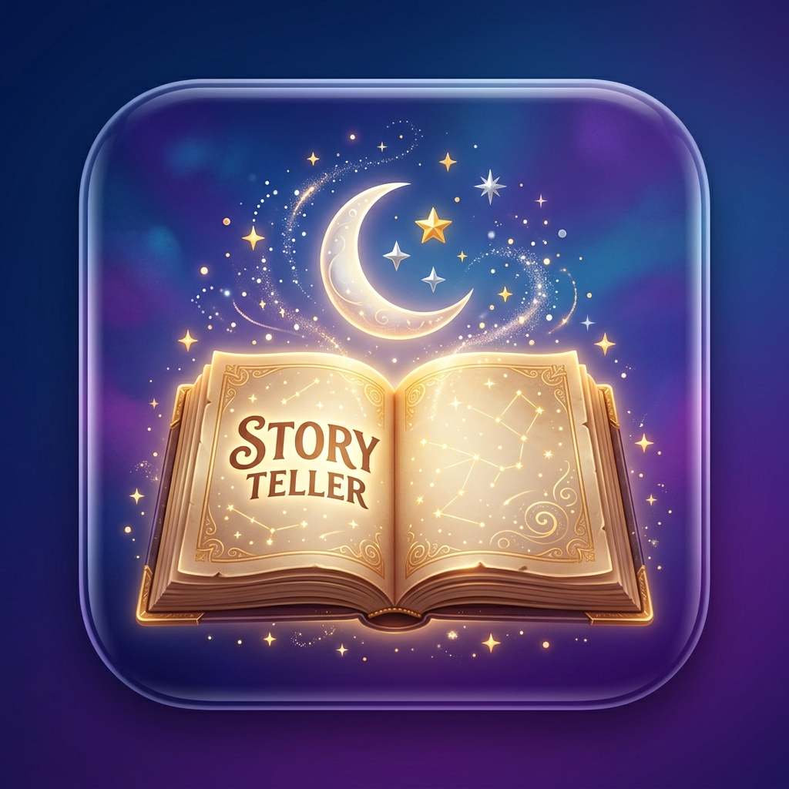
</p>

<h3 align="center">A Multilingual Interactive Storytelling Mobile App & Dedicated Flutter Web CMS Admin Dashboard</h3>

<p align="center">
  <a href="#-mobile-app-showcase">Mobile Showcase</a> •
  <a href="#-web-admin-panel-showcase">Admin Panel</a> •
  <a href="#-key-features">Features</a> •
  <a href="#-tech-stack--architecture">Tech Stack</a> •
  <a href="#-project-structure">Architecture</a> •
  <a href="#-getting-started">Installation</a> •
  <a href="#-author--contact">Contact</a>
</p>

<p align="center">
  
  
  
  
  
</p>

---

## 🌟 Executive Summary

**Story Teller** is a full-stack Flutter application designed for kids' storytelling and educational entertainment. The solution contains two connected applications within a single repository:

- **📱 Cross-Platform Mobile Client (`iOS` & `Android`)**: An engaging reading and listening experience with text-to-speech (TTS), multi-language support (English, Hindi, Spanish), age and category preferences, local persistence with Hive, and Firebase notifications.
- **💻 Web-Based Content Management System (Flutter Web Admin)**: A dedicated dashboard for administrators to manage stories and categories and update multilingual content through Cloud Firestore.

---

## 📱 Mobile App Showcase

<table align="center">
  <tr>
    <td align="center" width="33%">
      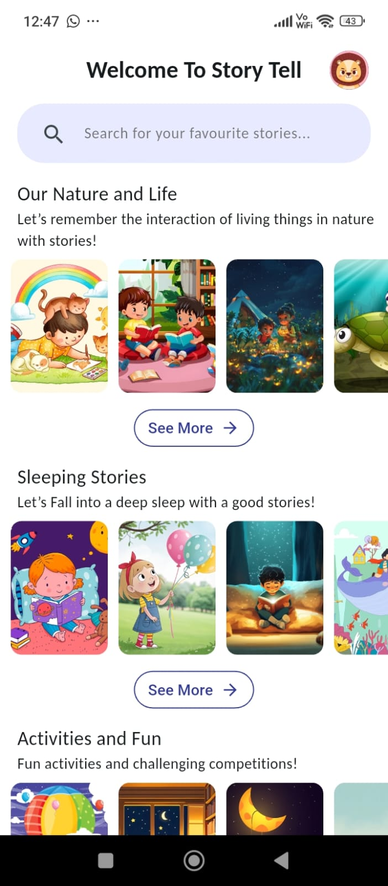
      <br />
      <b>🏠 Home & Story Feed</b>
      <p><i>Personalized story recommendations & categories</i></p>
    </td>
    <td align="center" width="33%">
      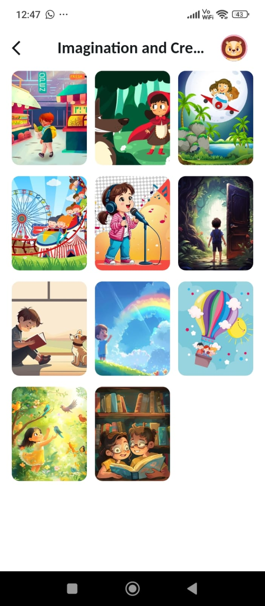
      <br />
      <b>📂 Category Discovery</b>
      <p><i>Browse by genre, theme, and age group</i></p>
    </td>
    <td align="center" width="33%">
      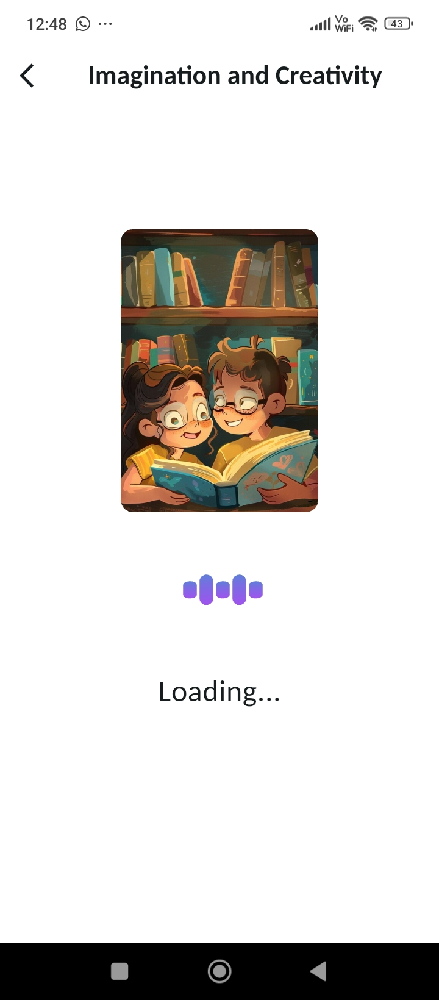
      <br />
      <b>✨ Delightful Loading Experience</b>
      <p><i>Smooth animations & kid-safe onboarding</i></p>
    </td>
  </tr>
  <tr>
    <td align="center" width="33%">
      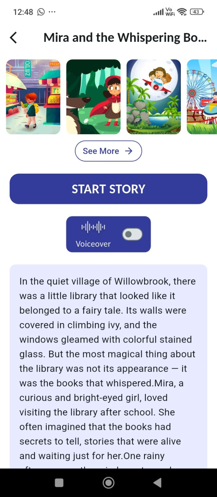
      <br />
      <b>🎧 Immersive Story Player & TTS</b>
      <p><i>Audio narration with real-time speech synthesis</i></p>
    </td>
    <td align="center" width="33%">
      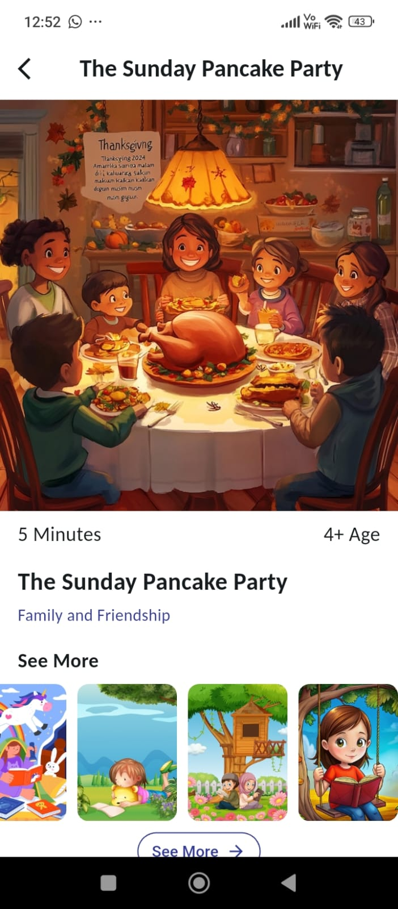
      <br />
      <b>📖 Detailed Story Overview</b>
      <p><i>Metadata, age suitability, and quick actions</i></p>
    </td>
    <td align="center" width="33%">
      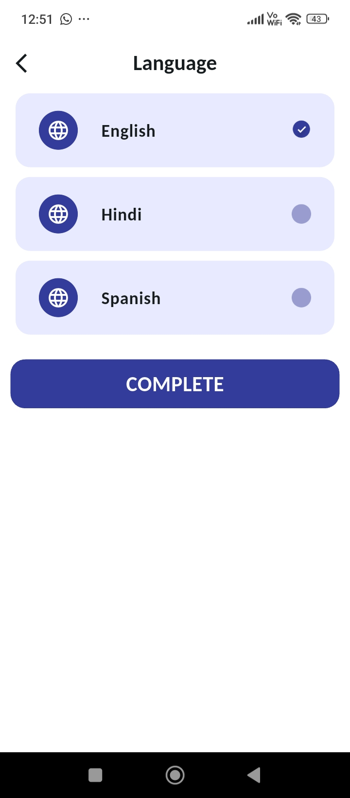
      <br />
      <b>🌍 Multilingual Switching</b>
      <p><i>Instant toggle between English, Hindi & Spanish</i></p>
    </td>
  </tr>
  <tr>
    <td align="center" colspan="3">
      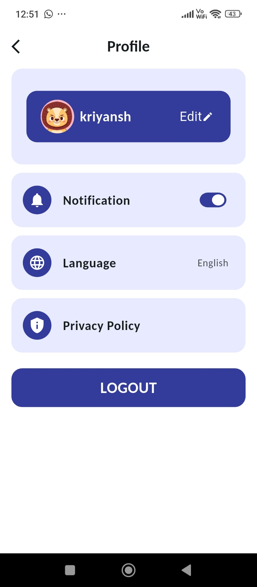
      <br />
      <b>👤 User Profile & Settings</b>
      <p><i>Notification preferences, favorite genres & parental controls</i></p>
    </td>
  </tr>
</table>

---

## 💻 Web Admin Panel Showcase

<table align="center">
  <tr>
    <td align="center" width="50%">
      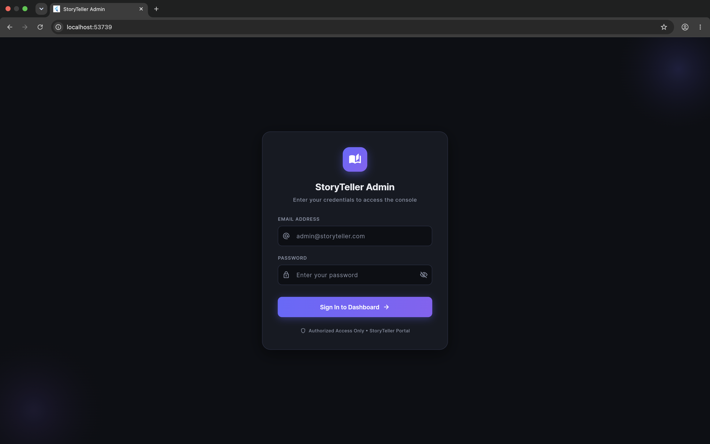
      <br />
      <b>🔐 Secure Administrator Authentication</b>
    </td>
    <td align="center" width="50%">
      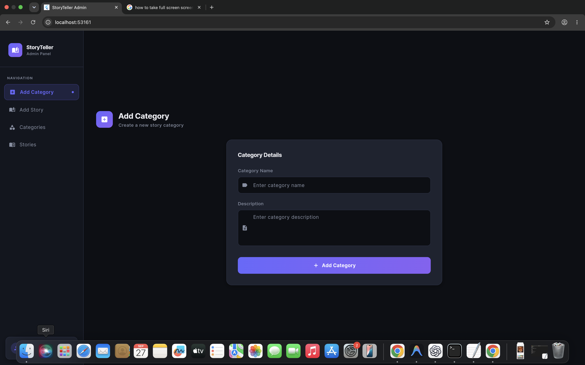
      <br />
      <b>📊 Central CMS Dashboard & Live Statistics</b>
    </td>
  </tr>
  <tr>
    <td align="center" width="50%">
      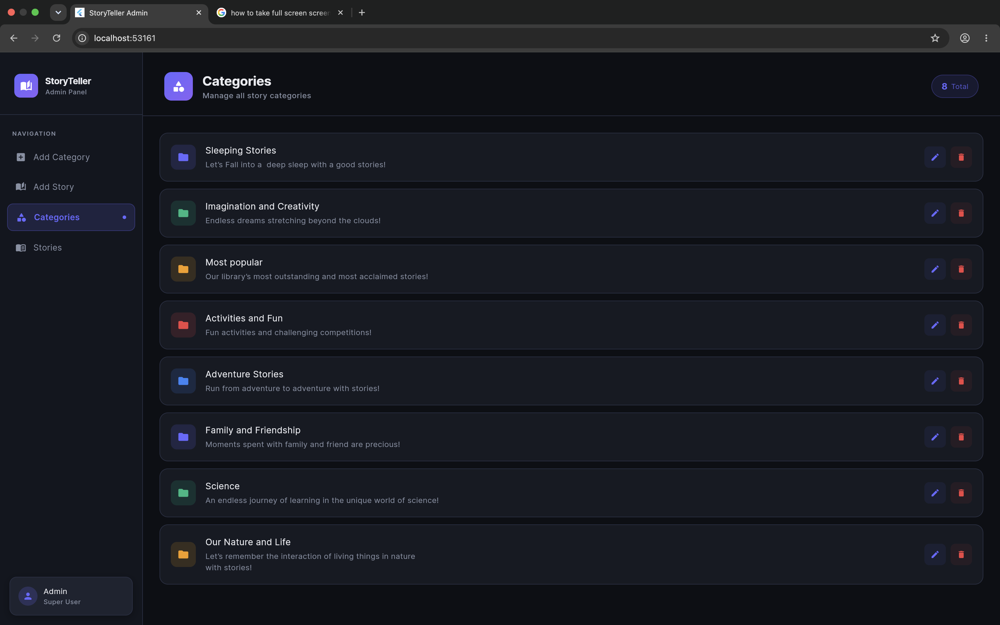
      <br />
      <b>🏷️ Dynamic Category Management</b>
    </td>
    <td align="center" width="50%">
      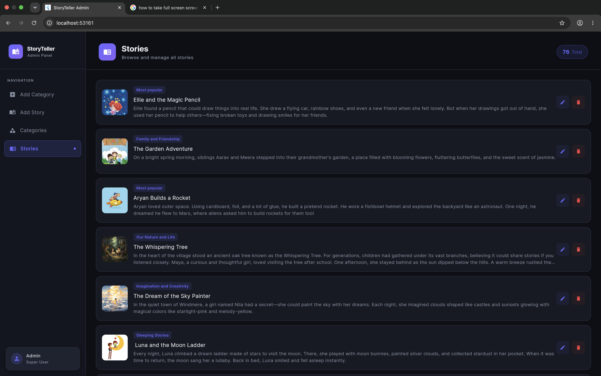
      <br />
      <b>📚 Story Catalog Management</b>
    </td>
  </tr>
  <tr>
    <td align="center" width="50%">
      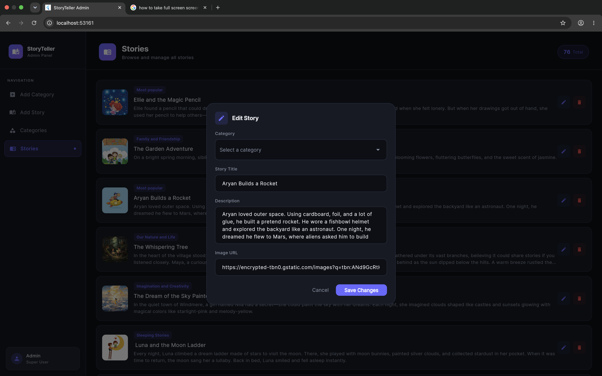
      <br />
      <b>✍️ Rich Story Creator & Editor</b>
    </td>
    <td align="center" width="50%">
      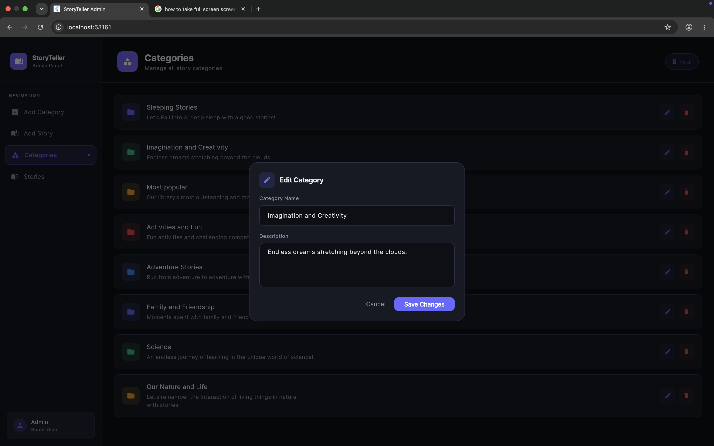
      <br />
      <b>🎨 Category Creation & Icon Management</b>
    </td>
  </tr>
</table>

---

## ✨ Key Features

### 📱 Client Mobile App
- **Interactive Story Reader**: Clean typographic interface tailored for readability with custom fonts (Inter & Carlito).
- **Text-to-Speech (TTS) Narration**: Built-in voice engine powered by `flutter_tts` allowing children to listen to stories read aloud with dynamic play/pause controls.
- **Multilingual Support (i18n)**: Seamless language localization for **English (`en`)**, **Hindi (`hi`)**, and **Spanish (`es`)**.
- **Offline Data Persistence**: Powered by **Hive DB** for caching stories and user preferences locally.
- **Category & Age Filtering**: Smart categorization allowing discovery of fairy tales, bedtime stories, moral tales, and adventure stories.
- **Push & Local Notifications**: Powered by **Firebase Cloud Messaging (FCM)** and `flutter_local_notifications` for story updates, reminders, and notifications.
- **Payment Integration**: Integrated Stripe payment flow for premium story-related downloads through a payment bottom sheet.
- **Responsive & Tested**: Responsive layouts tested across multi-device viewports via `device_preview`.

### 💻 Web Admin Panel (CMS)
- **Admin Authentication**: Dedicated administrator login using Firebase Authentication for controlled access to the content management dashboard.
- **Real-Time Cloud Firestore Sync**: Instant propagation of newly published stories and categories to client mobile devices.
- **Story Lifecycle Management (CRUD)**: Create, read, update, and delete stories with cover images, descriptions, categories, and content.
- **Category Management (CRUD)**: Create, organize, and reorder categories with custom icons and metadata.
- **Modern Responsive Dashboard**: Clean UI designed with customized Flutter Web widgets and Google Fonts.

---

## 🛠 Tech Stack & Architecture

### Mobile Application
| Domain | Technology / Package | Purpose |
|---|---|---|
| **Framework** | Flutter (SDK ^3.6.0) | Cross-platform mobile development (iOS & Android) |
| **Language** | Dart 3.6+ | Strongly-typed, object-oriented language |
| **State Management** | `provider` | Reactive state management & dependency injection |
| **Backend & Auth** | `firebase_auth`, `firebase_core`, `cloud_firestore` | Cloud authentication & real-time database |
| **Push Notifications** | `firebase_messaging`, `flutter_local_notifications` | Push notification delivery & local scheduling |
| **Local Cache** | `hive`, `hive_flutter`, `path_provider` | High-performance offline key-value storage |
| **Audio / TTS** | `flutter_tts` | Multilingual text-to-speech audio narration |
| **In-App Purchases** | `in_app_purchase` | Digital goods & premium story purchases |
| **UI & Animations** | `lottie`, `flutter_svg`, `smooth_page_indicator`, `scroll_to_hide` | Rich micro-animations & visual interactions |
| **Localization** | `flutter_localization`, `flutter_localizations`, `intl` | Dynamic runtime multilingual translation |

### Admin Web Panel
| Domain | Technology / Package | Purpose |
|---|---|---|
| **Framework** | Flutter Web | High-performance web dashboard application |
| **Backend** | `cloud_firestore`, `firebase_core` | Live content synchronization |
| **Typography** | `google_fonts` | Modern, responsive dashboard design |

---

## 📐 Project Structure

```text
story_teller_app/
│
├── admin_storyteller/              # 💻 Flutter Web Admin Panel
│   ├── lib/
│   │   ├── admin_credentials.dart  # Secure admin credentials configuration
│   │   ├── app_theme.dart          # Admin UI theme and color system
│   │   ├── login_screen.dart       # Authentication interface
│   │   ├── home.dart               # Main dashboard navigation & stats
│   │   ├── displayStory.dart       # Story list & CRUD actions
│   │   ├── displayCategory.dart    # Category list & CRUD actions
│   │   ├── story.dart              # Story editor modal/form
│   │   └── category.dart           # Category editor modal/form
│   └── pubspec.yaml
│
├── lib/                            # 📱 Story Teller Mobile Client
│   ├── core/                       # Core utilities, constants & services
│   │   ├── constant/               # App colors, styles, and asset constants
│   │   ├── presentation/           # Core presentation widgets
│   │   └── service/                # Notification & cloud messaging services
│   ├── features/                   # Feature-based modular architecture
│   │   └── home/
│   │       └── presentation/
│   │           ├── data/           # Repositories & data providers
│   │           ├── screens/        # Home, reading, profile, categories
│   │           └── widget/         # Feature-specific reusable UI widgets
│   ├── assets/                     # SVGs, animations (Lottie), fonts & i18n JSONs
│   │   └── lang/                   # en.json, hi.json, es.json
│   ├── appLocalization.dart        # Multilingual localization engine
│   ├── firebase_options.dart       # Firebase configuration
│   └── main.dart                   # Application entrypoint & Provider tree
│
├── screenshots/                    # 📸 Visual assets for repository showcase
│   ├── admin_panel/                # Web CMS screenshots
│   └── story_teller/               # Mobile app screenshots
│
└── pubspec.yaml                    # Root Flutter dependencies
```

---

## 🚀 Getting Started

### Prerequisites
- [Flutter SDK](https://docs.flutter.dev/get-started/install) (`>= 3.6.0`)
- Dart SDK (`>= 3.6.0`)
- Firebase CLI & configured Firebase project
- Android Studio / Xcode for mobile emulation or Google Chrome for Flutter Web

---

### 1. Clone the Repository
```bash
git clone https://github.com/reenarathod0804-hash/story_teller_app.git
cd story_teller_app
```

---

### 2. Run the Mobile Application
```bash
# Install root dependencies
flutter pub get

# Run on connected device or emulator
flutter run
```

---

### 3. Run the Web Admin Panel
```bash
# Navigate to the admin directory
cd admin_storyteller

# Setup your admin credentials
cp lib/admin_credentials.example.dart lib/admin_credentials.dart
# Edit lib/admin_credentials.dart with your admin email and password

# Install admin dependencies
flutter pub get

# Run Flutter Web Admin on Chrome
flutter run -d chrome
```

---

## 💼 Role & Engineering Highlights

As the **Flutter Developer** on this project:
- **Built the Mobile Application**: Developed the Flutter mobile application with Firebase integration, Provider state management, Hive local storage, multilingual support, and interactive story features.
- **Developed the Web Admin Panel**: Built a dedicated Flutter Web dashboard for managing stories and categories using Cloud Firestore.
- **Implemented Local Data Persistence**: Used Hive to store user preferences and locally cached application data.
- **Integrated Text-to-Speech**: Integrated `flutter_tts` to provide story narration with support for English, Hindi, and Spanish.
- **Implemented Multilingual Support**: Configured language switching across English, Hindi, and Spanish for the application's content and interface.
- **Organized Project Architecture**: Structured the application using feature-based folders, reusable widgets, Provider-based state management, and separate services for Firebase and notification functionality.

---

## 📬 Contact & Hire

Looking for a **Flutter Developer** to build mobile or web applications using Flutter and Firebase?

- **GitHub**: [@reenarathod0804-hash](https://github.com/reenarathod0804-hash)
- **Platform**: Open for freelance, contract, and full-time opportunities on **Upwork**
- **Specializations**: Flutter (iOS / Android / Web), Firebase, Provider, Hive, REST APIs, Firebase Authentication, Cloud Firestore, Notifications, Text-to-Speech, and payment integrations.

---

<p align="center">
  <sub>Built with ❤️ using Flutter & Firebase</sub>
</p>
